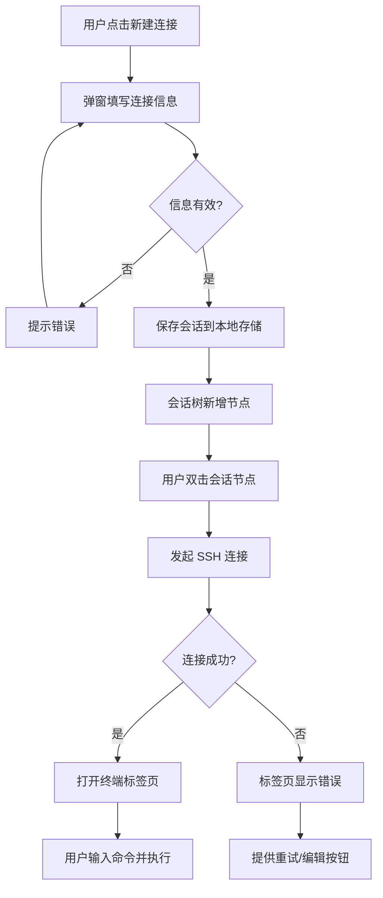
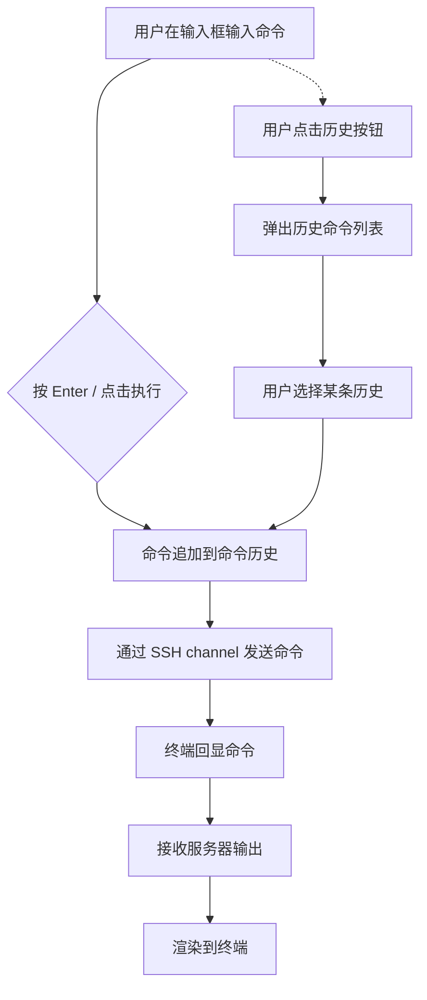
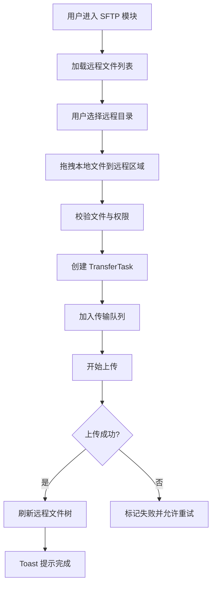
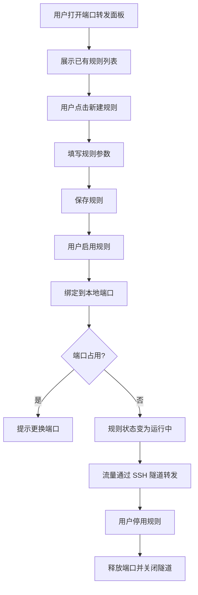
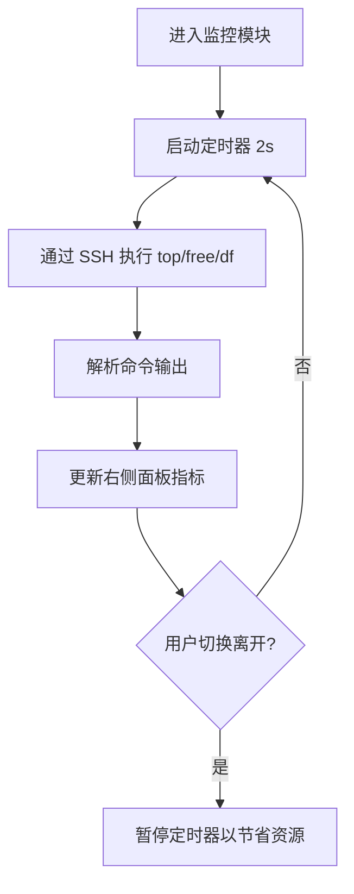

# Termix SSH 终端连接工具 — 产品需求文档（PRD）

> 版本：v1.0  
> 对应原型：`pages/index-v2.html`

---

## 1. 产品定位

Termix 是一款面向开发者和运维人员的 SSH 终端连接工具，目标是集成 MobaXterm 与 FinalShell 的核心能力，提供更现代、更统一、更高效的远程服务器管理体验。所有在竞品中需付费的「Pro 功能」在本产品中免费开放。

### 1.1 目标用户
- 后端开发 / DevOps / SRE
- 系统管理员
- 需要同时管理多台远程服务器的个人开发者或小团队

### 1.2 核心价值
- **多会话管理**：标签页 + 会话树 + 分组，支持同时维护几十台服务器。
- **终端体验**：命令历史、片段、搜索、分屏、日志保存。
- **文件传输**：内置 SFTP，拖拽上传下载，传输队列可视化。
- **网络工具**：端口转发、跳板机 / 堡垒机支持。
- **系统监控**：实时 CPU / 内存 / 磁盘 / 网络监控。
- **免费高级功能**：多窗口、SFTP、端口转发、监控、云同步等均免费。

---

## 2. 功能全景

| 模块 | 核心功能 | 优先级 |
|---|---|---|
| 连接管理 | 新建 / 编辑 / 删除 / 分组 SSH 连接；导入导出；搜索过滤 | P0 |
| 终端 | 多标签终端；命令输入；命令历史；命令片段；复制/粘贴；日志保存；清屏；分屏 | P0 |
| SFTP | 本地/远程双栏文件管理；上传/下载/拖拽；断点续传；传输队列；权限修改 | P0 |
| 端口转发 | 本地/远程/动态端口转发；多规则管理；快速启停 | P1 |
| 监控 | 实时 CPU、内存、磁盘、网络、进程 Top；历史曲线 | P1 |
| 命令片段 | 保存常用命令；支持变量占位符；快速插入 | P1 |
| 插件 | 脚本市场；自定义插件；主题包 | P2 |
| 设置 | 主题、字体、快捷键、会话持久化、云同步、安全策略 | P1 |
| 用户系统 | 可选账号体系，用于云同步配置和历史；支持离线使用 | P2 |

---

## 3. 全局交互规则

### 3.1 窗口框架
- **标题栏**：高度 40px，左侧为系统灯（macOS 风格）、应用 Logo/名称、当前连接选择器、全局搜索。
- **活动导航栏（Activity Rail）**：宽 48px，左侧垂直排列。点击切换主功能区：终端会话、SFTP、端口转发、命令片段、监控、插件、帮助。
- **侧边栏**：宽 240px，显示当前功能区的二级内容（如会话树、文件树）。
- **主工作区**：中央区域，显示标签页和内容。
- **右侧面板**：宽 280px，显示辅助信息（如资源监控、传输队列）。
- **底部状态栏**：高 24px，显示当前连接状态、编码、快捷键提示、版本号。

### 3.2 主题与颜色
- 默认深色主题，背景层级：
  - `--bg-base-default`：主画布
  - `--bg-base-secondary`：侧边栏、标题栏、输入区
  - `--bg-overlay-l1` / `--bg-overlay-l2`：悬停、选中、浮层面板
- 状态色：
  - `--status-success-default`：在线、成功
  - `--status-warning-default`：警告、磁盘高占用
  - `--status-error-default`：离线、断开、错误
  - `--status-primary-default`：品牌操作、进行中
- 终端代码色：
  - `--code-parameter`：用户名/主机名
  - `--code-attribute`：当前路径
  - `--code-instruction`：输入的命令
  - `--code-doc`：命令输出文本
  - `--text-default`：光标

### 3.3 通用组件行为
- **按钮**：
  - 主按钮（brand）：执行、确认
  - 次级按钮（secondary）：复制、保存日志
  - 文字/图标按钮（tertiary）：刷新、设置、新建
  - 危险按钮（danger-subtle）：断开连接
- **标签（Tag）**：
  - 在线/离线状态使用 `ds-tag--success` / 默认灰
  - 「Pro 功能免费」使用品牌绿 pill
- **输入框**：聚焦时边框变为 `--border-brand`。
- **文件树/会话树**：
  - 点击整行选中
  - 点击 chevron 展开/折叠
  - 右键菜单：连接、编辑、复制、删除、新建分组

---

## 4. 模块详细说明

### 4.1 连接管理

#### 4.1.1 会话树（左侧边栏）
- **结构**：
  - 最近连接：平铺展示最近使用过的服务器。
  - 分组：用户自定义分组（如「生产环境」「测试环境」），可嵌套。
  - 每个分组右侧显示数量徽章。
- **状态显示**：
  - 在线：绿色圆点 + 「在线」标签
  - 离线：灰色圆点 + 「离线」标签
  - 连接中：黄色圆点 + 旋转 loading 图标
- **图标规则**：
  - 服务器行：状态色圆点
  - 子连接（用户@主机）：`user.svg`
  - 分组内具体连接：`plug.svg`
- **交互**：
  - 双击服务器行：打开新终端标签页。
  - 右键菜单：
    - 连接 / 在新标签连接
    - 编辑连接
    - 复制连接
    - 移动到分组
    - 删除
    - 属性（显示备注、密钥、最后连接时间）

#### 4.1.2 新建/编辑连接（弹窗）
字段：
- 名称（必填）
- 主机地址 / IP（必填）
- 端口（默认 22）
- 用户名（必填）
- 认证方式：密码 / 私钥（选择文件）/ SSH Agent / 双因子
- 私钥路径 + 私钥密码
- 备注
- 分组选择
- 高级选项：
  - 代理 / 跳板机
  - 连接超时
  - 心跳间隔
  - 启动后自动执行命令
  - 编码

#### 4.1.3 全局搜索
- 标题栏搜索框支持按名称、主机、用户名、分组搜索会话。
- 回车打开第一个匹配项；下拉列表显示最近 10 条结果。

---

### 4.2 终端模块

#### 4.2.1 编辑器标签页
- 每个终端 / SFTP / 监控面板以标签页形式打开。
- 标签显示：功能图标 + 标题 + 关闭按钮。
- 标签右键菜单：关闭、关闭其他、关闭右侧、复制标签、重命名。
- 支持多行标签，超过宽度时横向滚动或折叠。

#### 4.2.2 工具栏
显示当前会话信息：
- 在线状态圆点
- 用户名@主机
- IP 地址
- 已连接时长（实时递增）
- 操作按钮：复制选中、保存日志、断开

#### 4.2.3 终端内容区
- 使用 xterm.js 或等效组件渲染。
- 支持鼠标选中、右键复制粘贴。
- 支持字体大小缩放（Ctrl + +/-）。
- 支持搜索（Ctrl + F）。
- 支持清屏（`clear` 命令或按钮）。

#### 4.2.4 命令输入区
- 输入框：`输入命令...` placeholder
- **执行按钮**：将输入框内容发送到当前终端会话。
- **历史按钮**：点击弹出最近执行过的命令列表（按时间倒序，最多 50 条），点击即可填入输入框并执行。
- 支持上下方向键在输入框中快速切换历史命令。

#### 4.2.5 命令片段
- 在 Activity Rail 的「命令片段」入口管理。
- 每条片段包含：标题、命令内容、变量占位符（如 `{{host}}`）、分组。
- 在终端中可通过快捷键或按钮快速插入片段。

#### 4.2.6 分屏
- 工具栏「分屏」按钮将当前标签页区域上下/左右拆分为两个独立终端。
- 每个分屏可独立连接不同会话。

---

### 4.3 SFTP 模块

#### 4.3.1 文件浏览器
- 进入方式：Activity Rail 点击 SFTP，或终端中点击 SFTP 标签页。
- 双栏布局：左侧远程文件树，右侧本地文件树（默认当前用户主目录）。
- 顶部工具栏：刷新、上传、下载、删除、新建文件夹、重命名、权限、搜索。

#### 4.3.2 文件操作
- 单击选中，双击打开/进入文件夹。
- 右键菜单：下载、删除、重命名、修改权限、复制路径。
- 拖拽：本地文件拖到远程 = 上传；远程拖到本地 = 下载。
- 支持断点续传，失败可重试。

#### 4.3.3 传输队列（右侧面板）
- 显示当前上传/下载任务列表。
- 每条任务包含：文件名、方向图标、进度条、速度、剩余时间、暂停/取消按钮。
- 传输完成后保留 5 秒，然后自动移入「已完成」折叠区。

---

### 4.4 端口转发模块

#### 4.4.1 规则列表
- 列表展示所有转发规则：名称、类型（本地/远程/动态）、本地端口、远程主机、远程端口、状态。
- 操作：启用/停用、编辑、删除。

#### 4.4.2 新建规则
字段：
- 规则名称
- 类型：本地端口转发 / 远程端口转发 / 动态 SOCKS 代理
- 本地地址（默认 127.0.0.1）
- 本地端口
- 远程地址（远程转发时必填）
- 远程端口
- 绑定会话

---

### 4.5 监控模块

#### 4.5.1 资源监控（右侧面板常驻）
- CPU：百分比 + 进度条（绿 < 70%，黄 < 90%，红 ≥ 90%）。
- Memory：已用 / 总量 + 进度条。
- Disk：根分区使用率 + 进度条。
- Network：上传速度 / 下载速度。
- 刷新频率：默认 2 秒，可在设置中调整。

#### 4.5.2 监控详情页
- 点击 Activity Rail「监控」打开全屏监控页：
  - 实时曲线图（最近 5 分钟）
  - 进程 Top 列表（CPU / 内存排序）
  - 磁盘分区详情
  - 网络连接数

---

### 4.6 设置模块

#### 4.6.1 通用设置
- 语言
- 主题（深色/浅色/跟随系统）
- 字体（终端字体、界面字体、字号）
- 启动行为（恢复上次会话 / 打开启动页）

#### 4.6.2 终端设置
- 光标样式（块状/下划线/竖线）
- 行数限制
- 右键行为
- 自动换行
- 滚动缓冲区大小

#### 4.6.3 安全设置
- 主密码（用于加密本地保存的私钥密码）
- 会话锁定时间
- 指纹确认策略
- 日志审计开关

#### 4.6.4 云同步
- 登录账号后可同步：会话列表、命令片段、设置、历史记录。
- 支持手动/自动同步。
- 未登录时所有数据仅本地存储。

---

## 5. 数据模型

### 5.1 Session（会话）
```json
{
  "id": "uuid",
  "name": "prod-api-01",
  "host": "192.168.10.21",
  "port": 22,
  "username": "root",
  "authType": "password | key | agent | 2fa",
  "password": "encrypted",
  "privateKeyPath": "/path/to/key",
  "privateKeyPassphrase": "encrypted",
  "groupId": "group-uuid",
  "tags": ["production"],
  "memo": "生产 API 服务器",
  "encoding": "utf-8",
  "keepAliveInterval": 30,
  "connectTimeout": 10,
  "startupCommands": ["cd /var/log", "htop"],
  "proxy": { "type": "jump", "jumpSessionId": "uuid" },
  "createdAt": 1754700000000,
  "lastConnectedAt": 1754700000000
}
```

### 5.2 Group（分组）
```json
{
  "id": "uuid",
  "name": "生产环境",
  "parentId": null,
  "order": 0
}
```

### 5.3 CommandHistory（命令历史）
```json
{
  "id": "uuid",
  "sessionId": "uuid",
  "command": "htop",
  "executedAt": 1754700000000
}
```

### 5.4 Snippet（命令片段）
```json
{
  "id": "uuid",
  "title": "查看大文件",
  "command": "ls -lh {{path}} | tail -n 20",
  "variables": [{"name": "path", "default": "/var/log"}],
  "groupId": "uuid"
}
```

### 5.5 TransferTask（传输任务）
```json
{
  "id": "uuid",
  "sessionId": "uuid",
  "direction": "upload | download",
  "localPath": "/Users/me/file.txt",
  "remotePath": "/root/file.txt",
  "status": "pending | running | paused | completed | failed",
  "progress": 45,
  "speed": "1.2 MB/s",
  "error": null
}
```

### 5.6 ForwardRule（端口转发规则）
```json
{
  "id": "uuid",
  "name": "MySQL 本地转发",
  "type": "local | remote | dynamic",
  "localHost": "127.0.0.1",
  "localPort": 3306,
  "remoteHost": "127.0.0.1",
  "remotePort": 3306,
  "sessionId": "uuid",
  "enabled": true
}
```

---

## 6. 关键流程

### 6.1 新建连接并打开终端
1. 用户点击侧边栏「+」或标题栏「新建连接」。
2. 弹窗填写连接信息，保存。
3. 会话树新增节点。
4. 双击节点 → 建立 SSH 连接 → 打开新标签页 → 显示终端。
5. 连接失败时标签标题变红，标签内显示错误信息，提供重试按钮。

### 6.2 执行命令
1. 用户在输入框输入命令。
2. 点击「执行」或按 Enter → 命令发送到后端 SSH channel。
3. 命令回显到终端，追加到命令历史。
4. 后端返回输出，渲染到终端。

### 6.3 上传文件
1. 用户在 SFTP 界面选中远程目录。
2. 拖拽本地文件到远程区域，或点击上传按钮选择文件。
3. 生成 TransferTask，加入传输队列。
4. 右侧面板显示进度。
5. 完成后 toast 提示，远程文件树刷新。

### 6.4 断开连接
1. 用户点击工具栏「断开」或关闭最后一个终端标签。
2. 关闭 SSH session，释放资源。
3. 会话树状态变为离线。
4. 保留标签页内容但标记为「已断开」。

---

## 7. 异常与边界情况

| 场景 | 处理方案 |
|---|---|
| 连接超时 | 显示重试按钮，保留输入内容 |
| 认证失败 | 弹窗提示，可重新输入密码 |
| 私钥损坏/不存在 | 标签页显示错误，引导重新选择密钥 |
| 网络断开 | 自动重连 3 次，失败后提示手动重连 |
| 命令执行超时 | 提供 Ctrl+C 按钮强制中断 |
| SFTP 权限不足 | 显示错误信息，提供 sudo 选项 |
| 传输中断 | 支持断点续传，失败任务可重试 |
| 端口转发端口被占用 | 提示选择其他本地端口 |

---

## 8. 技术建议

### 8.1 前端
- 框架：Electron（跨平台桌面）或 Tauri（更轻量）。
- 终端组件：xterm.js。
- 状态管理：Zustand / Pinia / Redux Toolkit。
- 文件树：react-arborist 或自研虚拟列表。
- 图表：Recharts / Chart.js（监控曲线）。

### 8.2 后端
- SSH 库：Node.js 用 `ssh2`；Rust 用 `russh`。
- SFTP：基于 `ssh2-sftp-client` 或原生 SFTP 子系统。
- 持久化：SQLite（本地）+ 可选远程云同步接口。
- 安全：本地私钥加密存储（AES-256-GCM + 主密码派生密钥）。

### 8.3 数据存储
- 配置文件：JSON / SQLite，位于用户数据目录。
- 日志：本地 rotating log，可选上传云端审计。

---

## 9. 开发里程碑

| 阶段 | 内容 | 预计周期 |
|---|---|---|
| MVP | 连接管理、多标签终端、命令输入与历史 | 2 周 |
| v0.2 | SFTP 双栏文件管理、传输队列 | 2 周 |
| v0.3 | 端口转发、命令片段、系统监控 | 2 周 |
| v0.4 | 设置、主题、快捷键、云同步 | 2 周 |
| v1.0 | 插件市场、性能优化、正式发布 | 2 周 |

---

## 10. 原型对照说明

当前 `pages/index-v2.html` 展示的是 **MVP 阶段主界面**，重点呈现：
- 标题栏 + Activity Rail + 会话侧边栏的导航结构
- 多标签终端布局
- 命令输入与执行/历史按钮
- 右侧资源监控与传输队列
- 深色主题下的视觉层次与状态表达

后续阶段可在该原型基础上扩展：
- Activity Rail 切换时，主工作区替换为对应模块（SFTP、端口转发、命令片段、监控详情）。
- 右侧面板根据当前模块动态变化（终端模式显示监控，SFTP 模式显示传输队列）。
- 设置入口以弹窗/新窗口形式打开。

---

## 11. 交互流程图

以下为核心功能的 Mermaid 流程图，可直接用于开发沟通或导入支持 Mermaid 的文档/看板工具。

### 11.1 新建连接并打开终端



### 11.2 命令执行与历史



### 11.3 SFTP 文件上传



### 11.4 端口转发生命周期



### 11.5 系统监控数据刷新



---

## 12. API 接口表

以下接口为应用内部前后端（或主进程与渲染进程）之间的抽象接口。若采用 Electron/Tauri 架构，可作为 IPC 通道定义；若采用客户端-服务端分离架构，可作为 REST/WebSocket 接口设计参考。

### 12.1 会话管理

| 接口 | 方法 | 入参 | 出参 | 说明 |
|---|---|---|---|---|
| `session.create` | IPC/POST | `Session` 对象 | `{ id, success, error }` | 创建并保存新会话 |
| `session.update` | IPC/PUT | `{ id, ...partialSession }` | `{ success, error }` | 更新会话信息 |
| `session.delete` | IPC/DELETE | `{ id }` | `{ success, error }` | 删除会话 |
| `session.list` | IPC/GET | `{ groupId?, keyword? }` | `Session[]` | 列出会话，支持分组和搜索 |
| `session.groups` | IPC/GET | - | `Group[]` | 获取分组树 |
| `session.connect` | IPC/POST | `{ id, tabId }` | `{ success, error, connectionId }` | 建立 SSH 连接 |
| `session.disconnect` | IPC/POST | `{ connectionId }` | `{ success, error }` | 断开连接 |
| `session.test` | IPC/POST | `{ host, port, username, auth }` | `{ success, error }` | 测试连接可用性 |

### 12.2 终端操作

| 接口 | 方法 | 入参 | 出参 | 说明 |
|---|---|---|---|---|
| `terminal.create` | IPC/POST | `{ connectionId, tabId }` | `{ shellId, success }` | 为连接创建终端 shell |
| `terminal.data` | WebSocket/IPC | `{ shellId, data }` | - | 向终端发送数据（键盘输入） |
| `terminal.onData` | WebSocket/IPC | - | `{ shellId, data }` | 接收终端输出 |
| `terminal.resize` | IPC/POST | `{ shellId, cols, rows }` | `{ success }` | 调整终端尺寸 |
| `terminal.destroy` | IPC/POST | `{ shellId }` | `{ success }` | 销毁终端 |
| `terminal.copy` | IPC/POST | `{ shellId, text }` | `{ success }` | 复制选中内容到剪贴板 |
| `terminal.saveLog` | IPC/POST | `{ shellId, path }` | `{ success, path }` | 保存终端日志到本地文件 |

### 12.3 命令历史与片段

| 接口 | 方法 | 入参 | 出参 | 说明 |
|---|---|---|---|---|
| `history.list` | IPC/GET | `{ sessionId?, limit=50 }` | `CommandHistory[]` | 获取命令历史 |
| `history.clear` | IPC/DELETE | `{ sessionId? }` | `{ success }` | 清空历史 |
| `snippet.list` | IPC/GET | `{ groupId? }` | `Snippet[]` | 获取命令片段 |
| `snippet.create` | IPC/POST | `Snippet` | `{ id, success }` | 创建片段 |
| `snippet.update` | IPC/PUT | `{ id, ...partialSnippet }` | `{ success }` | 更新片段 |
| `snippet.delete` | IPC/DELETE | `{ id }` | `{ success }` | 删除片段 |

### 12.4 SFTP 操作

| 接口 | 方法 | 入参 | 出参 | 说明 |
|---|---|---|---|---|
| `sftp.list` | IPC/POST | `{ connectionId, remotePath }` | `{ items: SftpItem[] }` | 列出远程目录 |
| `sftp.upload` | IPC/POST | `{ connectionId, localPath, remotePath, taskId }` | `{ taskId }` | 发起上传任务 |
| `sftp.download` | IPC/POST | `{ connectionId, remotePath, localPath, taskId }` | `{ taskId }` | 发起下载任务 |
| `sftp.remove` | IPC/POST | `{ connectionId, remotePath }` | `{ success, error }` | 删除远程文件/目录 |
| `sftp.rename` | IPC/POST | `{ connectionId, oldPath, newPath }` | `{ success, error }` | 重命名 |
| `sftp.mkdir` | IPC/POST | `{ connectionId, remotePath }` | `{ success, error }` | 新建目录 |
| `sftp.chmod` | IPC/POST | `{ connectionId, remotePath, mode }` | `{ success, error }` | 修改权限 |
| `transfer.list` | IPC/GET | - | `TransferTask[]` | 获取传输队列 |
| `transfer.pause` | IPC/POST | `{ taskId }` | `{ success }` | 暂停任务 |
| `transfer.resume` | IPC/POST | `{ taskId }` | `{ success }` | 恢复任务 |
| `transfer.cancel` | IPC/POST | `{ taskId }` | `{ success }` | 取消任务 |
| `transfer.onProgress` | WebSocket/IPC | - | `{ taskId, progress, speed }` | 传输进度推送 |

### 12.5 端口转发

| 接口 | 方法 | 入参 | 出参 | 说明 |
|---|---|---|---|---|
| `forward.list` | IPC/GET | `{ sessionId? }` | `ForwardRule[]` | 列出规则 |
| `forward.create` | IPC/POST | `ForwardRule` | `{ id, success }` | 创建规则 |
| `forward.update` | IPC/PUT | `{ id, ...partialRule }` | `{ success }` | 更新规则 |
| `forward.delete` | IPC/DELETE | `{ id }` | `{ success }` | 删除规则 |
| `forward.start` | IPC/POST | `{ id }` | `{ success, error }` | 启用规则 |
| `forward.stop` | IPC/POST | `{ id }` | `{ success }` | 停用规则 |

### 12.6 系统监控

| 接口 | 方法 | 入参 | 出参 | 说明 |
|---|---|---|---|---|
| `monitor.metrics` | IPC/POST | `{ connectionId }` | `{ cpu, memory, disk, network }` | 单次获取指标 |
| `monitor.subscribe` | IPC/POST | `{ connectionId, interval=2000 }` | `{ subscriptionId }` | 订阅实时指标 |
| `monitor.unsubscribe` | IPC/POST | `{ subscriptionId }` | `{ success }` | 取消订阅 |
| `monitor.onMetrics` | WebSocket/IPC | - | `{ connectionId, metrics }` | 指标实时推送 |
| `monitor.processes` | IPC/POST | `{ connectionId, sortBy='cpu', limit=20 }` | `Process[]` | 获取进程 Top 列表 |

### 12.7 设置与用户

| 接口 | 方法 | 入参 | 出参 | 说明 |
|---|---|---|---|---|
| `settings.get` | IPC/GET | - | `Settings` | 获取全部设置 |
| `settings.set` | IPC/PUT | `Partial<Settings>` | `{ success }` | 更新设置 |
| `auth.login` | IPC/POST | `{ email, password }` | `{ token, user }` | 用户登录 |
| `auth.logout` | IPC/POST | - | `{ success }` | 退出登录 |
| `sync.push` | IPC/POST | - | `{ success, error }` | 手动上传配置到云端 |
| `sync.pull` | IPC/POST | - | `{ success, data, error }` | 从云端拉取配置 |

### 12.8 通用事件推送

| 事件名 | 方向 | 数据 | 说明 |
|---|---|---|---|
| `event.connection.statusChanged` | 后端 → 前端 | `{ connectionId, status }` | 连接状态变化 |
| `event.transfer.progress` | 后端 → 前端 | `{ taskId, progress, speed }` | 传输进度 |
| `event.monitor.metrics` | 后端 → 前端 | `{ connectionId, metrics }` | 监控指标 |
| `event.terminal.output` | 后端 → 前端 | `{ shellId, data }` | 终端输出 |
| `event.toast` | 后端 → 前端 | `{ type, message }` | 全局 Toast 通知 |

---

## 13. 接口错误码

| 错误码 | 含义 | 处理建议 |
|---|---|---|
| `SSH_CONNECTION_TIMEOUT` | SSH 连接超时 | 检查网络与端口，提供重试 |
| `SSH_AUTH_FAILED` | 认证失败 | 重新输入密码或检查密钥 |
| `SSH_HOST_UNREACHABLE` | 主机不可达 | 检查 IP/域名与防火墙 |
| `SFTP_PERMISSION_DENIED` | SFTP 权限不足 | 提示使用 sudo 或检查用户权限 |
| `SFTP_PATH_NOT_FOUND` | 远程路径不存在 | 提示用户确认路径 |
| `TRANSFER_FAILED` | 传输失败 | 允许重试或断点续传 |
| `PORT_ALREADY_IN_USE` | 本地端口被占用 | 提示更换端口 |
| `KEY_DECRYPTION_FAILED` | 私钥解密失败 | 检查私钥密码 |
| `CLOUD_SYNC_CONFLICT` | 云同步冲突 | 提示选择本地/云端版本 |
| `INTERNAL_ERROR` | 内部错误 | 记录日志并引导反馈 |

